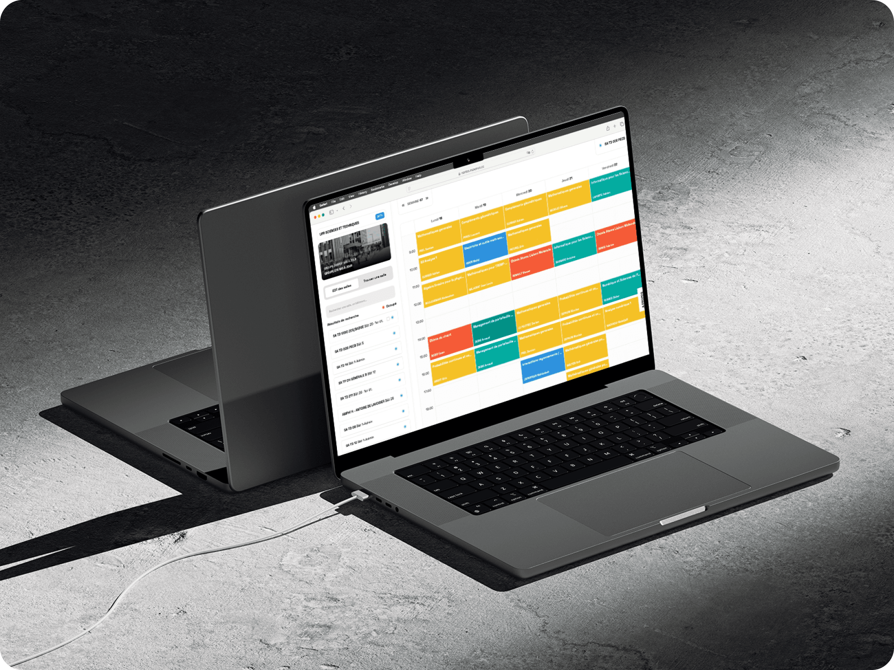

# UNsalib

<div style="display: flex; gap: 12px; padding-bottom: 12px;">
  
  
  
  
  
  
  
</div>

<p align="center">
  
</p>

## 🗝️Research and development

We're proud to present this project. After dedicating significant time to finding a correct and viable solution, we discuss and showcase our research in this document (french): https://docs.google.com/document/d/1F2fmTzl88viRSR_j6lHnVwBSEmp1OsEqbVQG_SYG2fM/edit?usp=sharing

## ✨ Privacy

Only the necessary data is stored on the device, and the application does not collect any personal information.

- [x] No tracking
- [x] No ads

## 🛠️ Development

### Prerequisites

You will need to have a downloaded version of nodejs at least v20:  https://nodejs.org/fr/download/package-manager/current

### Quick start

1. Move to the backend directory
```bash
cd backend
```

2. Install dependencies
```bash
npm install
```

3. Rename and complete .env
```bash
mv example.env .env
nano .env
```

4. Start the backend server
```bash
npm run dev
```

5. Move to the frontend directory
```bash
cd ../frontend
```

6. Install dependencies
```bash
npm install
```

7. Rename and complete .env
```bash
mv example.env .env
nano .env
```

8. Run the frontend development server
```bash
npm run dev
```

9. Open [http://localhost:3000](http://localhost:3000) with your browser to see the result

### Production build (with PM2)

1. Move to the backend directory
```bash
cd backend
```

2. Start the backend production server
```bash
pm2 start server.js --name unsalib-backend
```

3. Move to the frontend directory
```bash
cd ../frontend
```

4. Build the application
```bash
npm run build
```

5. Run the frontend production server
```bash
pm2 start --name unsalib-frontend -- npm run start
```

6. Open [http://localhost:3000](http://localhost:3000) with your browser to see the result

### PWA installation

This table sum up the browsers supported for installing UNsalib as a PWA

| - | Chrome | Edge | Opera | Firefox | Safari |
| -- | -- | -- | -- | -- | -- |
| Windows | ✅ | ✅ | ❌ | ❌ | - |
| Android | ✅ | ❓ | ❌ | ❌ | - |
| iOS | ❓ | ❓ | ❓ | ❓ | ❓ |
| iPadOS | ❌ | ❓ | ❓ | ❌ | ✅ |
| MacOS | ❓ | ❓ | ❓ | ❌ | ❓ |
| Linux | ✅ | ✅ | ❌ | ❌ | - |

## 🙏 Acknowledgments

Thank you to Nantes Université for their support and to our teachers! This project was made possible thanks to the existing timetable service: https://edt-v2.univ-nantes.fr/sciences/

## 📄 License

UNsalib is licensed under the **GNU General Public License v3.0 (GPL-3.0)**, a copyleft license that ensures users’ freedom to run, study, share, and modify the software. Licensed works, modifications, and larger works must also be distributed under GPL-3.0, and source code must be provided or made available.